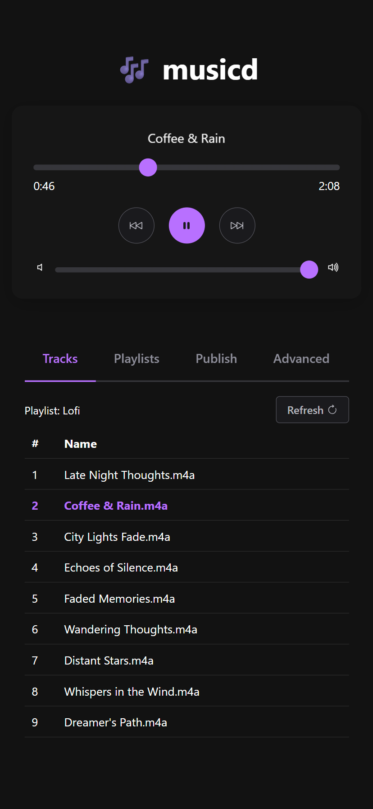

# 🎶 musicd

Portable file-based headless music player daemon for devs

## Features

- Plays local playlists on loop (indefinitely)
- CLI and embedded Web UI
- Pluggable downloaders (YouTube and others via [yt-dlp](https://github.com/yt-dlp/yt-dlp))
- Remote manifest polling
- Job scheduling

## Web UI



## Getting Started

### Requirements

- [yt-dlp](https://github.com/yt-dlp/yt-dlp)

### Installation

You can download pre-compiled binaries from the [releases](https://github.com/itsKaynine/musicd/releases) page and add the binary to your `PATH` environment variable.

Alternatively, you can install `musicd` using Cargo, Rust's package manager.

```sh
cargo install musicd
```

### Usage

To start the daemon and server:

```sh
musicd start
```

Open the Web UI at http://localhost:8371

### CLI

```sh
# Get status
musicd status

# List jobs
musicd jobs

# Publish playlist
musicd publish --name="My Playlist" --downloader="yt-dlp" -- <url_1> <url 2>...

# Clean unused files and directories
musicd clean

# Play
musicd play

# Pause
musicd pause

# Previous track
musicd prev

# Next track
musicd next

# Seek to position
musicd seek <secs>

# Set volume
musicd volume <value>

# Switch to a playlist id
musicd playlist <id> [--mode=queue|skip>]

# Switch to a track index
musicd track <idx>
```

To specify remote URL use the `host` argument:

```sh
musicd status --host="http://<remote_ip>:8371"
```

See `help` for complete usage:

```sh
musicd help
```

```sh
musicd playlist --help
```

## Config

Create `settings.json` in a working directory:


### Example:

```json
{
    "environment": "local",
    "data_dir": "./data",
    "server": {
        "host": "0.0.0.0",
        "port": 8371
    },
    "manifest": {
        "enable": false,
        "url": "http://localhost:5128/manifest.json",
        "check_interval_secs": 900
    },
    "player": {
        "auto_play": true,
        "default_audio_effects": true
    },
    "publish": {
        "auto_set_playlist": false
    },
    "job": {
        "max_late_secs": 10
    },
    "downloader": {
        "default": "yt-dlp",
        "yt_dlp": {
            "path": "yt-dlp"
        }
    }
}
```

## Jobs

Create `jobs.json` in the data directory (eg. `./data/jobs.json`).

You can schedule playlists, such as setting Christmas music to play on Christmas Eve every year.

```json
[
    {
        "id": "christmas",
        "run_at": "2025-12-24T00:00:00+00:00",
        "repeat": "yearly",
        "method": "POST",
        "url": "http://localhost:8371/playlist/c679006c-c195-4934-bb5a-7948f4b56209",
        "body": {"mode": "skip"}
    }
]
```

### Job Object Reference

| Field        | Type                 | Required | Description                                                                                                                                  |
| ------------ | -------------------- | -------- | -------------------------------------------------------------------------------------------------------------------------------------------- |
| `id`         | `string`             | Yes      | Unique identifier for the job. Useful for tracking and updating jobs.                                                                        |
| `run_at`     | `string` (ISO date)  | Yes      | The initial date and time when the job should first run. Must be in [ISO 8601](https://en.wikipedia.org/wiki/ISO_8601) format with timezone. |
| `repeat`     | `string` \| `object` | No       | Defines the repeat schedule. Can be a template (`"daily"`, `"weekly"`, etc.) or an object with `frequency` and `every`.                      |
| `end_repeat` | `string` (ISO date)  | No       | The date and time after which the job stops repeating. If omitted, the job repeats indefinitely.                                             |
| `method`     | `string`             | Yes      | HTTP method to use when executing the job (e.g., `GET`, `POST`, `PUT`, `DELETE`).                                                            |
| `url`        | `string` (URL)       | Yes      | The target URL to send the request to.                                                                                                       |
| `body`       | `object`             | No       | Optional request body. Typically used with `POST` or `PUT`.                                                                                  |


### Repeats

#### Templates

You can use one of the predefined repeat templates:

```
daily
weekdays
weekends
weekly
biweekly
monthly
yearly
```

#### Custom frequency

If you need more control, you can define your own frequency with a repeat object.

Supported base frequencies are:

```
daily
weekly
monthly
yearly
```

For example, to repeat **every 3 days**:

```json
[
    {
        "id": "christmas",
        "run_at": "2025-12-24T00:00:00+00:00",
        "repeat": {"frequency": "daily", "every": 3},
        "method": "POST",
        "url": "http://localhost:8371/playlist/c679006c-c195-4934-bb5a-7948f4b56209",
        "body": {"mode": "skip"}
    }
]
```

#### Ending a repeat

By default, a job repeats indefinitely.
To stop at a certain point, add the `end_repeat` field:

```json
[
    {
        "id": "christmas",
        "run_at": "2025-12-24T00:00:00+00:00",
        "repeat": "yearly",
        "end_repeat": "2030-01-01T00:00:00+00:00",
        "method": "POST",
        "url": "http://localhost:8371/playlist/c679006c-c195-4934-bb5a-7948f4b56209",
        "body": {"mode": "skip"}
    }
]
```

## Data Directory Layout

```
data/
  playlists/
    2025-08-My_Mix_abcd1234/
      001-Track.m4a
      ...
      playlist.json
  tmp/
  db/
```

## Downloaders

1. [yt-dlp](https://github.com/yt-dlp/yt-dlp)

## Contributing

We welcome contributions from the community. To contribute to `musicd`, please follow these steps:

### Fork the repository

1. Create a new branch for your changes
2. Make your changes and commit them
3. Push your changes to your forked repository
4. Submit a pull request
5. Please ensure that your code adheres to the Rust [coding style guidelines](https://www.rust-lang.org/policies/code-of-conduct#coding-style) and is properly formatted using [rustfmt](https://github.com/rust-lang/rustfmt).

## License

`musicd` is dual licensed under the [MIT License](https://opensource.org/licenses/MIT) and [Apache-2.0 License](https://opensource.org/licenses/Apache-2.0). See the LICENSE-MIT and LICENSE-APACHE-2.0 files for more information.